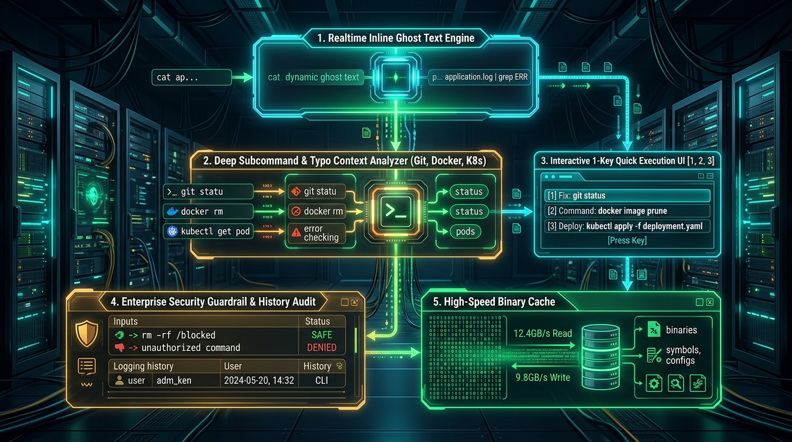
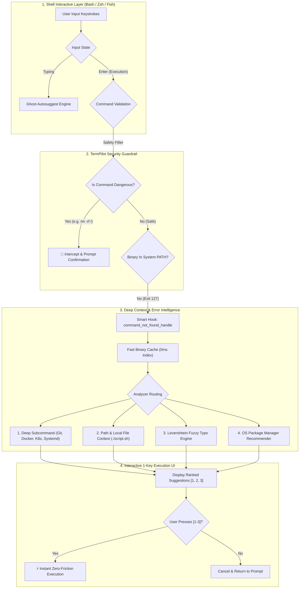

# ⚡ TermPilot: System Architecture & Engineering Guide

> **Open-Source Universal Linux Terminal Copilot, Deep Context Analysis & Security Suite**

---

## 🏛️ TermPilot System Architecture



---

## 📊 Core Subsystems & Lifecycle Flow



---

## 🚀 5 Core Modules Breakdown

### Module 1: High-Speed Indexed Binary Cache
* **Files:** `cache/binaries.cache` & `bin/termpilot-helper.sh`
* **Performance:** **< 2 milliseconds** lookup latency.
* **Mechanism:** Rather than walking `$PATH` directories synchronously during every typo, TermPilot maintains an indexed binary cache updated asynchronously. This guarantees zero lag even on enterprise servers with 10,000+ binaries.

---

### Module 2: Deep Subcommand Context Analyzers
* **Context Modules:** Git, Docker, Systemd (`systemctl`), Kubernetes (`kubectl`).
* **Mechanism:** Intercepts typos in subcommands and flags:
  - `git pus` ➜ `💡 Deep Context (git): Did you mean 'git push'?`
  - `docker imags` ➜ `💡 Deep Context (docker): Did you mean 'docker images'?`
  - `systemctl staus nginx` ➜ `💡 Deep Context (systemctl): Did you mean 'systemctl status nginx'?`
  - `kubectl get pds` ➜ `💡 Deep Context (kubectl): Did you mean 'kubectl get pods'?`

---

### Module 3: Interactive 1-Key Quick Execution (`[1]`, `[2]`, `[3]`)
* When an error or typo occurs, TermPilot displays the top ranked corrections.
* Simply press **`1`**, **`2`**, or **`3`** on your keyboard to **instantly execute** the suggested command without re-typing!

```
┌────────────────────────────────────────────────────────────────────────┐
│ $ sl -la                                                               │
│ ✖ Command not found: 'sl'                                              │
│   Did you mean one of these?                                           │
│     [1] ls - List directory contents with details and colors           │
│     [2] ss - Socket statistics utility for TCP/UDP                     │
│     [3] sh - Standard command interpreter shell                        │
│                                                                        │
│   Press [1-3] to run immediately, or any key to cancel: [User hits 1]  │
│   ➜ Running: ls -la                                                    │
└────────────────────────────────────────────────────────────────────────┘
```

---

### Module 4: Enterprise Security Guardrail & History Audit
* **Safety Filter:** Intercepts high-risk destructive commands (`rm -rf /`, `chmod -R 777 /`, formatting wrong disk partitions via `mkfs`, raw `dd` overwrites).
* **Security Audit CLI (`termpilot audit`):** Scans shell history for accidental leakage of plaintext secrets (AWS keys, GitHub tokens `ghp_...`, Bearer tokens, passwords).

---

### Module 5: Open-Source Extensibility & Custom Tools
* **`termpilot add`:** Add custom internal commands, dev scripts, and company cheatsheets.
* **`termpilot doctor`:** Automated diagnostics checking shell compatibility, latency, database integrity, and package manager availability.
* **`termpilot stats`:** Productivity analytics showing total commands run, top 10 most utilized CLI tools, and efficiency metrics.
* **`? <cmd>`:** Microsecond cheatsheet and flag search across 250+ enterprise tools.
